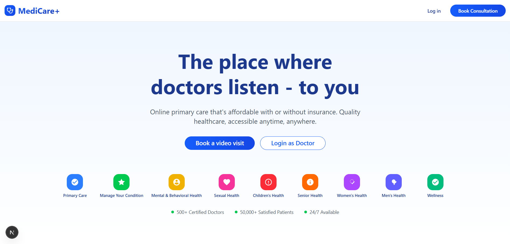

# 🏥 Medicine Center

**Medicine Center** — це сучасна веб-платформа для онлайн-медичних консультацій, яка дозволяє пацієнтам швидко знаходити лікарів, бронювати консультації та проводити відеодзвінки у безпечному середовищі.

---

## 👥 Команда проєкту

- **Козар Роман**  
  Frontend-розробка: інтерфейс користувача, адаптивна верстка, інтеграція з бекендом, участь у реалізації автентифікації та API.

- **Смолен Антон**  
  UI/UX дизайн, стилізація, створення сучасних компонентів, backend-розробка: REST API, робота з базою даних, автентифікація та авторизація.

---

## 🎯 Мета проєкту

Забезпечити зручний, швидкий та безпечний доступ до медичних консультацій онлайн, спростивши взаємодію між пацієнтами та лікарями без необхідності фізичної присутності.

---

## ❗ Проблема, яку вирішує продукт

Багато пацієнтів стикаються з труднощами у швидкому доступі до медичної допомоги:

- черги у поліклініках;
- відсутність потрібного спеціаліста поблизу;
- складність запису на прийом.

Водночас лікарям складно організувати повноцінні дистанційні консультації з управлінням пацієнтами та онлайн-взаємодією.  
**Medicine Center** вирішує ці проблеми шляхом цифровізації медичних консультацій.

---

## 🚀 Основний функціонал

### 👤 Для пацієнтів

- Реєстрація та вхід у систему
- Перегляд списку лікарів
- Бронювання онлайн-консультацій
- Проведення відеодзвінків з лікарями

### 🩺 Для лікарів

- Реєстрація та автентифікація
- Створення та редагування профілю
- Проведення онлайн-консультацій
- Взаємодія з пацієнтами через відеозв’язок

---

## 🛠️ Технології

### Frontend

- **Next.js 15**
- **React.js**
- **TailwindCSS**
- **shadcn/ui**

### Backend

- **Node.js**
- **Express.js**
- **MongoDB + Mongoose**
- **JWT Authentication**
- **OAuth (Google Login)**

---

## 🔌 Інтеграції

- **ZEGOCLOUD** — відеодзвінки та онлайн-комунікація

---

## ⚙️ Додаткові інструменти

- **Axios** — HTTP-запити з фронтенду
- **Express Validator** — валідація вхідних даних
- **Middleware** — обробка помилок та перевірка доступу

---

## 📄 Документація проєкту

У репозиторії присутня повна документація завершеного проєкту:

- `SRS.md` — специфікація вимог
- `ProjectPlan.md` — план управління та матриця ризиків
- `TestCases.md` — тестові сценарії
- `README.md` — опис продукту та інструкції

---

## 📌 Статус проєкту

Проєкт завершений у межах навчального модуля.  
Архітектура системи дозволяє подальше масштабування та розширення функціоналу.

---

## 🧠 Висновок

**Medicine Center** — це приклад сучасної full-stack веб-платформи з акцентом на зручність користувачів, безпеку даних та реальний практичний сценарій використання у сфері онлайн-медицини.
